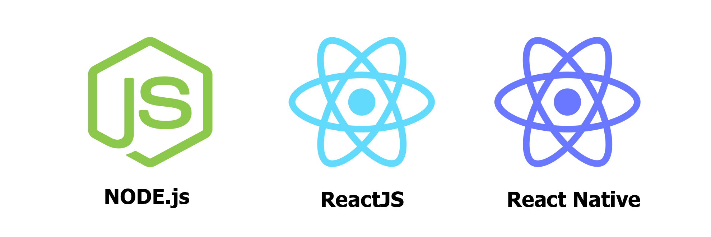

# Projeto FullStack
Aplicação completa utilizando a stack NodeJS/ReactJS/ReactNative

Projeto chamado como AirCnC, tem sua regra de negócio definida em dois públicos: 

- *Empresas* (Aplicação Web)   
- *Programadores* (Aplicação Mobile)

Assim as empresas disponibilizam seu espaço para os programadores (chamado Spot), e os mesmos através do aplicativo mobile, realizam sua reserva.

**Acesse:**  https://ricardotdeveloper.github.io/projeto-fullstack/  
> 
Para ter acesso a Aplicação Web e Mobile.